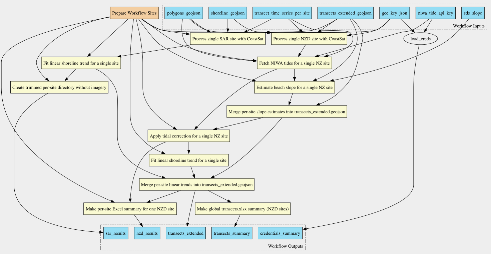

# CoastSat-CWL

A [Common Workflow Language (CWL)](https://www.commonwl.org/) implementation of the [CoastSat](https://github.com/UoA-eResearch/CoastSat) automated shoreline monitoring workflow. This repository provides containerized, reproducible workflows for processing satellite imagery to track coastal shoreline changes over time.

## Overview

CoastSat-CWL converts the original Python-based CoastSat processing pipeline into modular CWL workflows and tools, enabling:

- **Reproducible execution** via containerized workflows
- **Parallel processing** of multiple coastal sites
- **Incremental data updates** that build upon previous results
- **Automated processing** of satellite imagery from Google Earth Engine
- **Tidal corrections** for New Zealand sites using the NIWA Tide API
- **Statistical analysis** including beach slope estimation and linear trend modeling

## Workflow Diagram



## Key Components

- **`CoastSat-CWL/`**: Main CWL workflow and tool definitions

  - `workflow/`: Workflow definitions including `update_coastsat.cwl` (main workflow)
  - `tools/`: Individual CWL tool definitions for each processing step
  - `Dockerfile`: Container image with CoastSat dependencies
  - `environment.yml`: Conda environment specification
- **`results/`**: Execution directory with scripts and input files

  - `run_cwl.sh`: Script to execute the workflow
  - `input.yml`: Workflow input parameters (create this before running)
  - See `results/README.md` for detailed usage instructions
- **`workflow_diagram.svg`**: Visual diagram of the workflow structure and data flow

## Quick Start

1. Create an `input.yml` file in the `results/` directory (see `results/README.md` for details)
2. Run the workflow:
   ```bash
   cd results
   ./run_cwl.sh
   ```

The workflow processes satellite imagery, extracts shorelines, applies corrections, and generates time series data and statistical summaries.

## Workflow Features

The main `update_coastsat.cwl` workflow orchestrates:

- **Site preparation**: Organizes input sites (NZD for New Zealand, SAR for Sardinia)
- **Batch processing**: Downloads and processes satellite imagery from Google Earth Engine
- **Tidal correction**: Applies tidal corrections for New Zealand sites
- **Slope estimation**: Estimates beach slopes for transects
- **Linear modeling**: Calculates shoreline change trends and statistics
- **Output generation**: Produces Excel summaries and GeoJSON files with updated metrics

## Docker Container

The workflow is designed to run using the pre-built Docker image [`gusellerm/coastsat-cwl:latest`](https://hub.docker.com/repository/docker/gusellerm/coastsat-cwl/general), which bundles the complete execution environment including:

- Python 3.11 with scientific stack (NumPy, SciPy, scikit-learn, GDAL, GeoPandas, etc.)
- CoastSat package and processing scripts
- cwltool for workflow execution
- Full CoastSat-CWL repository with workflows and tools

Mount your data, configuration, and output directories as volumes:

```bash
docker run --rm \
  -v /path/to/data:/data \
  -v /path/to/cfg:/cfg \
  -v /path/to/out:/out \
  gusellerm/coastsat-cwl:latest \
  bash -lc 'cwltool --no-container --outdir /out \
    /workflow/workflow/update_coastsat.cwl \
    /cfg/input.yml'
```

Your input YAML should reference paths within `/data` (e.g., `/data/input/polygons.geojson`). All outputs are written to `/out`.

## Requirements

- Docker (for containerized execution)
- Google Earth Engine service account credentials
- NIWA Tide API key (for New Zealand sites)
- Network access to Google Earth Engine and NIWA API

See `CoastSat-CWL/Dockerfile` and `CoastSat-CWL/environment.yml` for dependency details.
